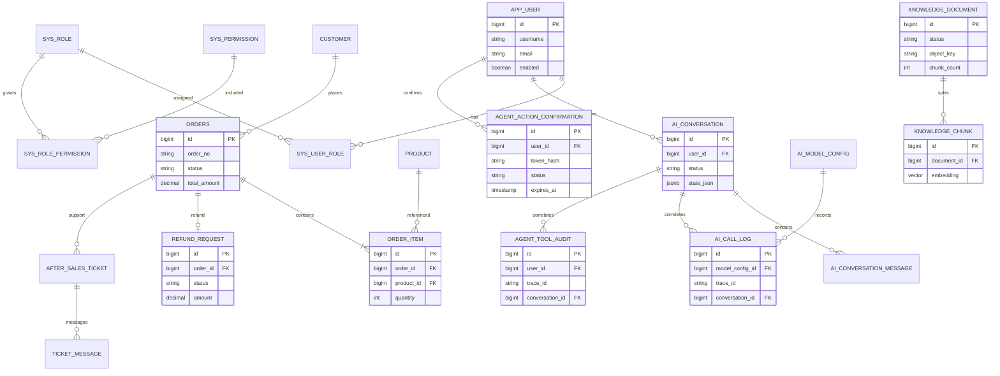

# 数据库关系图

下图聚焦核心关系，审计/配置表省略部分普通字段。完整定义以 `backend/smartmall-application/src/main/resources/db/migration` 的 V1～V16 为准。

```mermaid
erDiagram
  APP_USER ||--o{ SYS_USER_ROLE : has
  SYS_ROLE ||--o{ SYS_USER_ROLE : assigned
  SYS_ROLE ||--o{ SYS_ROLE_PERMISSION : grants
  SYS_PERMISSION ||--o{ SYS_ROLE_PERMISSION : included
  CUSTOMER ||--o{ ORDERS : places
  ORDERS ||--|{ ORDER_ITEM : contains
  PRODUCT ||--o{ ORDER_ITEM : referenced
  ORDERS ||--o| REFUND_REQUEST : refund
  ORDERS ||--o{ AFTER_SALES_TICKET : support
  AFTER_SALES_TICKET ||--o{ TICKET_MESSAGE : messages
  APP_USER ||--o{ AI_CONVERSATION : owns
  AI_CONVERSATION ||--o{ AI_CONVERSATION_MESSAGE : contains
  KNOWLEDGE_DOCUMENT ||--o{ KNOWLEDGE_CHUNK : splits
  AI_MODEL_CONFIG ||--o{ AI_CALL_LOG : records
  AI_CONVERSATION ||--o{ AI_CALL_LOG : correlates
  AI_CONVERSATION ||--o{ AGENT_TOOL_AUDIT : correlates
  APP_USER ||--o{ AGENT_ACTION_CONFIRMATION : confirms

  APP_USER { bigint id PK string username string email boolean enabled }
  ORDERS { bigint id PK string order_no string status decimal total_amount }
  ORDER_ITEM { bigint id PK bigint order_id FK bigint product_id FK int quantity }
  REFUND_REQUEST { bigint id PK bigint order_id FK string status decimal amount }
  KNOWLEDGE_DOCUMENT { bigint id PK string status string object_key int chunk_count }
  KNOWLEDGE_CHUNK { bigint id PK bigint document_id FK vector embedding }
  AI_CONVERSATION { bigint id PK bigint user_id FK string status jsonb state_json }
  AI_CALL_LOG { bigint id PK bigint model_config_id FK string trace_id bigint conversation_id FK }
  AGENT_TOOL_AUDIT { bigint id PK bigint user_id FK string trace_id bigint conversation_id FK }
  AGENT_ACTION_CONFIRMATION { bigint id PK bigint user_id FK string token_hash string status timestamp expires_at }
```

所有时间使用带时区时间戳保存；业务报表按 `Asia/Shanghai` 解释日期边界。向量维度固定为 1024。迁移脚本只追加，不改写已发布版本。
